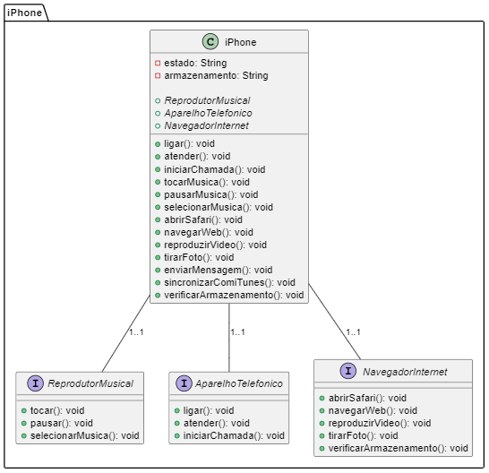

# Orientação a Objetos e UML: Diagramação de Classes do iPhone

O Diagrama UML do iPhone representa a estrutura e funcionalidade do dispositivo, dividindo-o em três principais grupos de funcionalidades: reprodução de música, telefone e navegação na internet.

## Descrição das Interfaces e Classes

### Reprodutor Musical (ReprodutorMusical)

A interface ReprodutorMusical descreve as capacidades de reprodução de música do iPhone, incluindo a capacidade de tocar, pausar e selecionar músicas. O iPhone é capaz de atuar como um reprodutor de música portátil, permitindo aos usuários desfrutar de suas músicas favoritas em movimento.

### Aparelho Telefônico (AparelhoTelefonico)

A interface AparelhoTelefonico representa as funcionalidades de telefone do iPhone, incluindo a capacidade de fazer e atender chamadas, bem como iniciar uma chamada de correio de voz. Essas funções são fundamentais para a comunicação através do dispositivo.

### Navegador de Internet (NavegadorInternet)

A interface NavegadorInternet descreve as funcionalidades de navegação na web do iPhone, incluindo a abertura do navegador Safari, a navegação na web, a reprodução de vídeos, a captura de fotos e a verificação do armazenamento disponível. O iPhone oferece uma experiência de navegação na internet completa, permitindo aos usuários acessar informações e entretenimento online.

A classe iPhone implementa todas essas interfaces, o que significa que o dispositivo é capaz de desempenhar múltiplos papéis simultaneamente, oferecendo uma experiência integrada e versátil para os usuários. Além disso, o diagrama destaca atributos importantes, como o estado do dispositivo e a capacidade de armazenamento, que desempenham um papel essencial em seu funcionamento.

## Visualizando o Diagrama UML

Para visualizar o diagrama UML, existem algumas opções disponíveis. Você pode copiar o código PlantUML e colá-lo em um editor compatível com PlantUML ou usar uma ferramenta online de renderização de PlantUML.

Usando PlantText (Ferramenta Online):

#### Acesse o site [PlantText](https://www.planttext.com/).
#### Cole o código PlantUML na área de texto.
#### Clique no botão "Refresh" para gerar o diagrama.

Lembre-se de que este é apenas um exemplo de diagrama de classe e pode ser personalizado e expandido de acordo com as necessidades específicas do seu projeto.